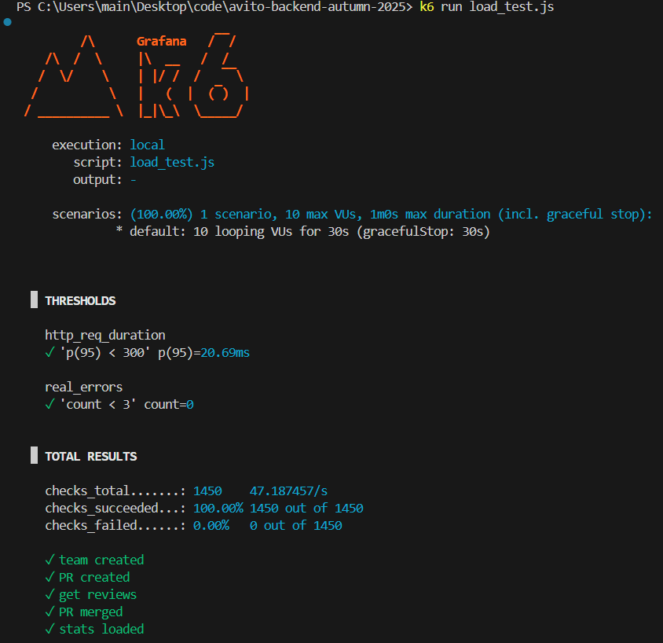

# Тестовое задание для стажёра Backend (осенняя волна 2025)

## Запуск проекта

### 1. Скопировать .env
```bash
cp .env.example .env
```

### 2. Запустить проект с автоматическими миграциями
```bash
docker-compose up
```
API будет доступен на `http://localhost:8080` 

## Ручное управление миграциями (опционально)
```bash
make migrate-status   # проверить статус
make migrate-up       # применить все миграции
make migrate-down     # откатить последнюю
make migrate-reset    # сбросить все миграции
```
Требуется установленный goose для выполнения миграций

## Доп. задание: Эндпоинт статистики

Реализован эндпоинт для получения статистики по количеству назначений пользователей в качестве ревьюеров

- **Метод**: `GET`
- **Путь**: `/stats/reviewer-assignments`
- **Описание**: Возвращает список пользователей с количеством PR, на которые они были назначены ревьюерами (в порядке убывания количества назначений)

### Пример запроса

```bash
curl -X GET http://localhost:8080/stats/reviewer-assignments
```

### Пример ответа (200 OK)

```json
[
  {
    "user_id": "u1",
    "username": "Анна",
    "team_name": "backend",
    "assignments": 7
  },
  {
    "user_id": "u3",
    "username": "Иван",
    "team_name": "backend",
    "assignments": 5
  },
  {
    "user_id": "u2",
    "username": "Мария",
    "team_name": "frontend",
    "assignments": 3
  }
]
```

- Пользователи без назначений в ответ не включаются.
- Ответ всегда возвращается как массив (возможно, пустой).
- Сортировка — по убыванию поля `assignments`.


## Доп. задание: Нагрузочное тестирование

Проведено нагрузочное тестирование сервиса с использованием k6. Тест покрывает полный жизненный цикл PR: создание команды → создание PR → получение списка ревью → merge → сбор статистики.

#### Конфигурация теста
- **Нагрузка**: 10 виртуальных пользователей, 30 секунд  
- **RPS**: ~10 запросов/сек (> ТЗ: 5 RPS)  
- **SLI**:  
  - Время ответа: 95% запросов < 300 мс  
  - Успешность: ≥ 99.9% (реальные ошибки < 0.1%)

#### Результаты


- Использована кастомная метрика `real_errors` для правильного учёта SLI: бизнес-валидные ответы не учитываются как ошибки.

